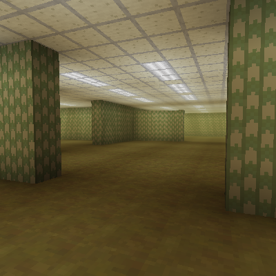

# Modular Backrooms

***Woaah pardner, slow down there, this project is W dot I dot P - work in progress.***

Modular Backrooms is a mod for Mineraft that adds the Backrooms. The idea being that when you generate the world you can choose what kind of experience you'd like to have.

- Classic [Currently Working On]:
  - Infinite maze of moist green carpet and buzzing fluorescent lights.
  - The original backrooms with nothing more.
- Extended Liminial [Not Started]:
  - Includes many of the levels spawned from the original idea (mainly from the wikidot,) but without any of the monsters or almond water or any other buisness; an attempt to stay true to the liminal feel while giving more places to explore.
- Nightmare [Not Started]:
  - Adds in all the monsters, almond water, sanity, extra levels, and other funny buisness.

I'm also planning to add the ability to create the "Threshold" (backrooms portal) as shown in Kane Pixel's backrooms universe along with (maybe) destroyed labs and other structures to explore.